# IBM Bob - Premium Package for i

<p align="center">
  
</p>

---

## Environment setup

### 1. Install the Premium Package for i / IBM i Developer Pack for VS Code and Bob IDE

1. Open **Bob IDE**.
2. Go to the **Extensions** (`Cmd+Shift+X` / `Ctrl+Shift+X`).
3. Search for **"Premium Package"** and install the **Premium Package for i** (publisher: *IBM*), that depends on extensions contained in the **IBM i Developer Pack** . This bundle includes:
   - **Code for IBM i** — source editing, object browser, IFS browser, Db2 for i extension etc.
4. After installation, reload Bob IDE when prompted.
5. In the **Bob** extension settings, ensure the **Premium Package for i** is activated — this unlocks the IBM i Developer and IBM i Database modes used in later exercises.

<p align="center">
  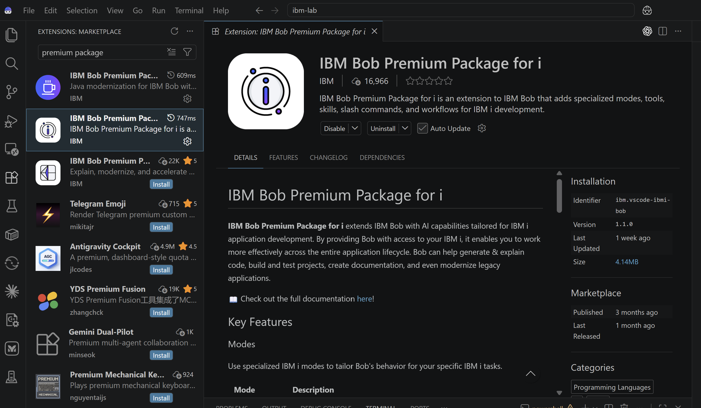
</p>

### 2. Keep track of your assigned library number

⚠️ The instructor will create libraries FLGHT401 through FLGHT4nn, each containing a full copy of all objects from FLGHT400. Each participant will have their assigned library (e.g. FLGHT401) added to their library list.

⚠️ Throughout the labs, participants must only use **their assigned number** so everyone can enjoy the labs.

| Student # | Library | Dev Port | React App URL |
|:---------:|---------|:--------:|---------------|
| 1  | FLGHT401 | 3001 | http://localhost:3001 |
| 2  | FLGHT402 | 3002 | http://localhost:3002 |
| 3  | FLGHT403 | 3003 | http://localhost:3003 |
| 4  | FLGHT404 | 3004 | http://localhost:3004 |
| … | … | … | … |
| 50 | FLGHT450 | 3050 | http://localhost:3050 |

### 3. Connection to IBM i

1. In Bob IDE, open the IBM i panel (left sidebar).
2. Click **New Connection** and enter the following data:

   - Host IP:
   - User profile: `ITZUSER`
   - Private key found [here](ssh_private_key.pem).


3. In the Code for IBM i object browser, browse library FLGHT4nn where you replace nn with your library number given to you by the instructor (ex: FLGHT400, FLGHT401, etc.) — this contains the original source members (RPG, CL, DDS, SQL) for reference.

4. Then, add your library to the user library list.

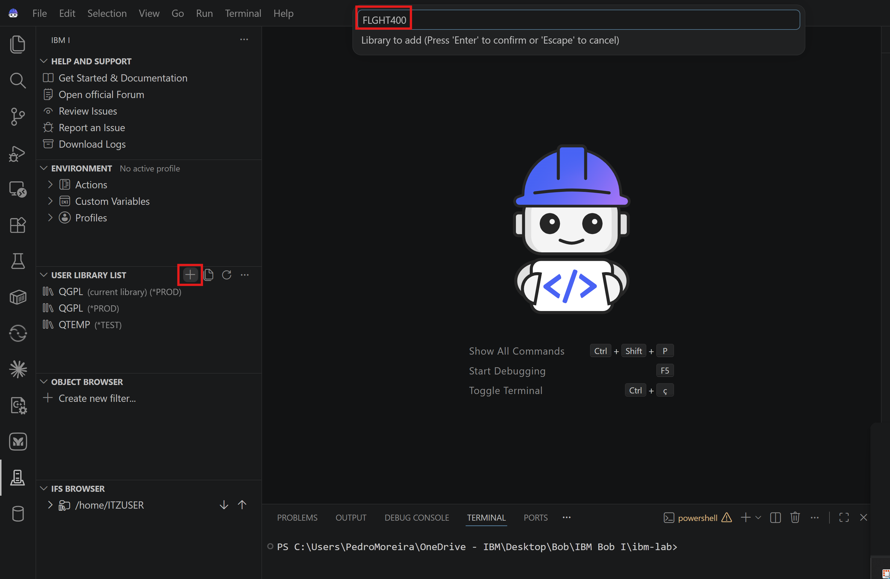

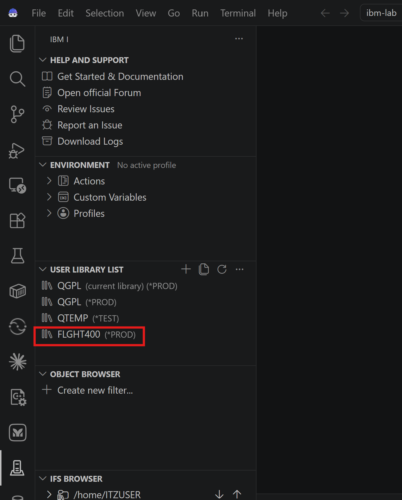
&nbsp;

✅ All set! You are now ready to start the exercises.

---

## Exercise 1 — Code explanation & architecture documentation

In this exercise, we will use Bob's IBM i Developer mode to automatically generate an architecture overview with diagrams, then switch to Database mode to produce an Entity Relationship Diagram.

### 1.1. Browse the application in the object browser

1. In the IBM i sidebar, expand **User Library List** and **Object Browser**.
2. Add **FLGHT4nn** (⚠️replace the 'nn' with your library number) to your library list if not done, and then add a filter to the **FLGHT4nn** library in the Object Browser. To see everything, make sure the filter is *ALL, not just *SRCPF. Then navigate to the **FLGHT4nn** library in the Object Browser. You will see its contents organized by object type:
   - `*PGM` — RPG and CL programs (e.g. `FRS001`, `FRS021`, `FRS409`)
   - `*FILE` — Display files and database physical/logical files
   - `*MENU` — Application menus

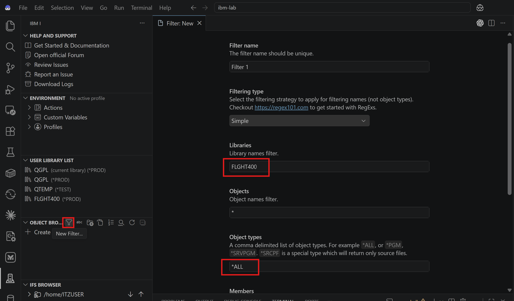
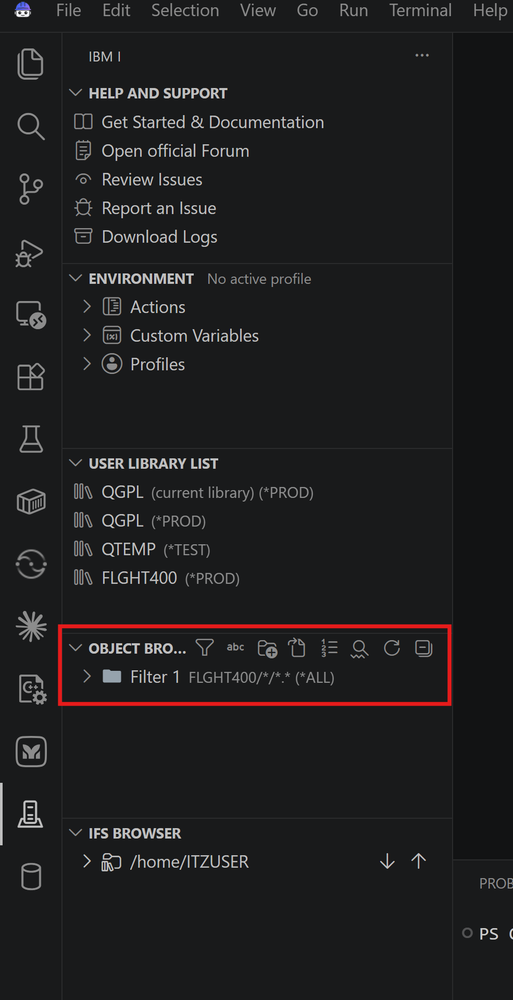


5. Expand **Source Files** and browse `QRPGSRC` — open a couple of RPG programs to get a feel for the classic fixed-format style.
6. Navigate to **`QDDSSRCD`** and open the display file `FRS001DF`. In the editor, Click on **Preview All** on the first line of code. It renders the green-screen layout visually — notice the classic 5250 style.

<p align="center">
  
</p>
### 1.2. Generate an architecture overview with Bob

1. Click the **Open Bob** icon in the top right Activity Bar to open the chat panel.
2. If not already in **IBM i Developer** mode, switch to it using the mode selector at the top of the chat.
3. Click the **`+` (Scope) button** and select **(QSYS) Library List** as the context scope. This gives Bob visibility into the full application structure. Again, make sure that `FLGHT4nn` is in the library list. Bob will first search in this list before searching in all QSYS.
4. ⚠️ Ask Bob the following, replacing `nn` with the two-digit suffix of your assigned library (e.g. `01` for `FLGHT401`, `02` for `FLGHT402`).

```text
Generate a comprehensive architecture overview of the FLIGHT4nn application in QSYS in Markdown format. Include a high-level description, the main program flows, key programs and their roles, a Mermaid architecture diagram, and a summary of the database tables used.
```

5. Bob will analyze the programs, source members, and database files and return a structured Markdown document. Review the output — notice how it identifies the menu-driven architecture, the core transaction programs, and the underlying database schema.

### 1.3. Generate an entity relationship diagram (database mode)

1. In the Bob chat panel, switch to **IBM i Database** mode using the mode selector.
2. ⚠️ Ask Bob using the `/erd` slash command (make sure it is highlighted in the chat), replacing `nn` with the two-digit suffix of your assigned library (e.g. `01` for `FLGHT401`, `02` for `FLGHT402`).

```text
/erd FLGHT4nn
```

3. Bob will introspect the physical files (`FLIGHTS`, `ORDERS`, `CUSTOMERS`, `AGENTS`, etc.) and their logical files, then generate a **Mermaid-style Entity Relationship Diagram (ERD)** showing the relationships between entities.
4. Analyze the results and observe the key relationships:
   - `ORDERS` links to `FLIGHTS`, `CUSTOMERS`, and `AGENTS`
   - `FLIGHTS` references `FRCITY` and `TOCITY` for departure/arrival cities

💡 Note: Bob can also integrate with external diagramming tools such as Draw.io, allowing you to generate richer, editable architecture diagrams from the application analysis.

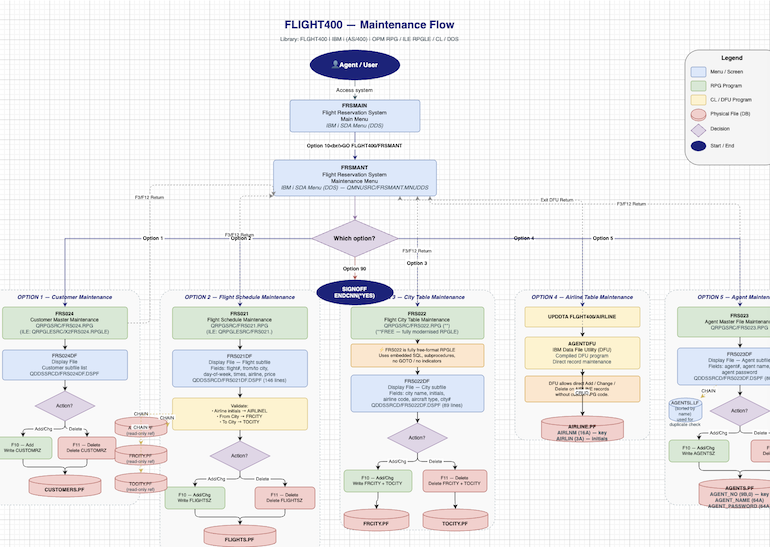

### 1.4. Generate business rules extraction

Drill down on a specific member by generating a functional business document using the Business Rules Extraction workflow.

1. Click the workflow icon at the top of the Bob panel, choose to run workflow in library list, and select **Business Rules Extraction**

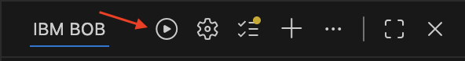

2. When prompted, use the following selections:

| Option | Value |
|---|---|
| Select Library | FLGHT4nn |
| Select Source File | QRPGLESRC |
| Select Member | FRS401.RPGLE |

3. Watch Bob create a guided workflow to get the necessary data and generate a complete report describing a business function. Bob will use subagents to create a document outlining business rules, decision logic, mermaid diagrams, process flows, etc. Documentation is written in business-friendly language, not technical jargon.

4. ⚠️ At the end, specify an output location on the IFS **unique to your library number**. For example: /home/ITZUSER/flght400/docs/business-rules/FRS401-2026-07-16T19-34-14.md

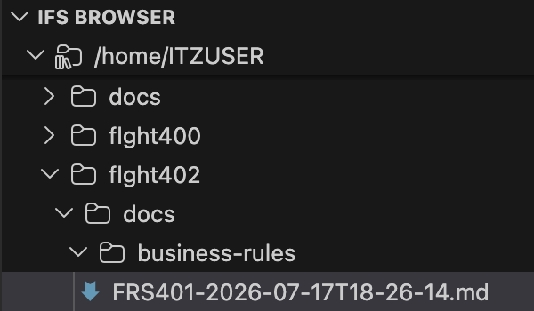

&nbsp;

✅ **Exercise 1 completed** - You've explored the legacy IBM i application, generated an architecture overview and ERD, and extracted business rules from an RPG program.

---

## Exercise 2 — Program-level explanation & modernization

In this exercise, you will use Bob to understand an old OPM RPG program, and then modernize it to free-format ILE RPG using the Bob modernization workflow.

### 2.1. Understand FRS409 (order modification confirmation)

1. Switch Bob back to **IBM i Developer** mode.
2. In the Object Browser, navigate to `FLGHT4nn/QRPGSRC` and open `FRS409`.
3. In the Bob chat panel, type:

```text
What does this program do?
```

4. Bob will explain the program: `FRS409` is the **Order Modification Confirmation Window** — an OPM RPG program that displays a confirmation popup when a user modifies an order. It handles F3 (Exit), F12 (Cancel), and Enter key inputs via a `DOUEQ` loop with `CASEQ` dispatch subroutines, using a workstation data structure (`WSDS`) to capture the last key pressed.

### 2.2. Modernize FRS409 using the RPG Modernization workflow

1. With `FRS409` still open in the editor, type in the Bob chat:

```text
Can you use a workflow to modernize this program?
```

2. Bob recognizes the fixed-format OPM RPG code and offers to run the **RPG Modernization (Fixed to Free Format) workflow**.
   → Choose **Start workflow** to start it.

3. The workflow form opens. Fill in the details:
   - **Source file:** `FLGHT4nn/QRPGSRC`
   - **Source member:** `FRS409` (Bob pre-fills this from the open editor)
   - Accept the other defaults and click **Analyze Member**.

Bob spins up a subagent to convert the fixed-format RPG to modern free-format ILE RPG.

4. Then Bob runs the **Code for IBM i** compile action for ILE RPG, triggering a `CRTBNDRPG` command on your LPAR. Watch the output in the terminal panel.

5. Bob will also prompt: **"Confirm Output Member Location"** — ensure the suggested location has the path with your library number and continue. Bob will use all its RPG skills to modernize this source code. Approve the requested tasks.

6. Take a look at your new modernized file at `FLGHT4nn/QRPGLESRC/FRS409.RPLGE`

### 2.3. Review the modernization summary

1. Review the **Modernization Summary Report** that Bob automatically generates in the Bob chat. It includes:

   - What was changed and why
   - Lines of code before vs. after
   - Opcode-by-opcode conversion notes
   - Compilation result

2. Ask Bob to save this information into a new file in your workspace.

```text
Using the generated information, create a file named 'FRS409-Modernization-Report.md' in my workspace.
```

&nbsp;

✅ **Exercise 2 completed** - You've just modernized a 30-year-old RPG program to modern free-format ILE RPG — with AI-assisted compilation — in minutes!

---

## Exercise 3 — Field expansion: Add total flight hours

In this exercise, you will use Bob to explore the Flight Maintenance application and add a new business field — *Total Flight Hours* — across its DDS and RPG components. The objective is to show Bob exploring legacy IBM i code, performing an impact analysis, making coordinated source changes, compiling the direct application path, and validating the result.

The completed field will be a four-digit whole number (type: Numeric, digits: 4, decimal places: 0, valid range: 0–9999) and it will use the following names:

| Layer | Field Name |
|---|---|
| Database | `FLHRS` |
| Logical / RPG | `FHRS` |
| Screen | `SFLHRS` |

In the Bob chat panel:

1. Select **IBM i Developer** mode.
2. Set the scope to **Library List (QSYS)**.
3. Confirm that `FLGHT4nn` is on the library list.

For this demonstration, Bob should update only the direct Flight Maintenance path: FLIGHTS → FLIGHTSZ → FRS021 → FRS021DF.

### 3.1. Explore the flight maintenance screen

Begin with the part of the application visible to the user.

1. ⚠️ Ask Bob the following, replacing `nn` with the two-digit suffix of your assigned library (e.g. `01` for `FLGHT401`, `02` for `FLGHT402`).

```text
Open the display file FRS021DF from FLGHT4nn/QDDSSRCD, show its current screen layout using the DDS Previewer, and list all the fields currently defined on the Flight Maintenance screen.
Also identify: the record format used by the screen; whether each field is input, output, or input/output; the naming convention used for screen fields, including examples such as SFLGHT, SMILES, SSEATS, and SPRICE; and how visible field labels are represented in the display-file DDS.
Do not modify, save, or compile anything.
```

Bob should preview the Flight Maintenance screen and list fields such as:

- Flight Number, Day of the Week, From City, To City
- Departure Time, Arrival Time
- Mileage, Airline, Seats Available, Ticket Price

Bob should also identify the screen-field naming pattern, including `SFLGHT`, `SMILES`, `SSEATS`, `SPRICE`.

### 3.2. Trace the existing pattern and perform an impact analysis

The new business requirement is to add *Total Flight Hours* to the Flight Maintenance application.

1. Use these fixed requirements:

| Attribute | Value |
|---|---|
| Business meaning | Total Flight Hours |
| Database field | `FLHRS` |
| Logical / RPG field | `FHRS` |
| Screen field | `SFLHRS` |
| Type | Numeric |
| Digits | 4 |
| Decimal places | 0 |
| Valid range | 0–9999 |
| Screen placement | Immediately after Mileage |

The database and screen fields use different names because this application uses an `S` prefix for screen fields.

2. ⚠️ Ask Bob the following, replacing `nn` with the two-digit suffix of your assigned library (e.g. `01` for `FLGHT401`, `02` for `FLGHT402`).

```text
Perform a focused impact analysis for adding Total Flight Hours to the Flight Maintenance application in FLGHT4nn.
Use these requirements: add database field FLHRS; expose it to RPG as FHRS; display it on the screen as SFLHRS; use four numeric digits with zero decimal positions; place it immediately after Mileage on the Flight Maintenance screen.
First, trace the existing Mileage field through the application. Show how the database field in FLIGHTS is exposed through FLIGHTSZ, handled by FRS021, and displayed as SMILES in FRS021DF.
Then identify the minimum source members that must change to implement Total Flight Hours in the direct Flight Maintenance path. Confirm: whether FLIGHTS is defined by DDS; whether FLIGHTSZ explicitly lists and renames fields; how FRS021 defines the FLIGHTSZ record layout; how FRS021 maps database values to screen values; which objects must be rebuilt or recompiled.
Mention any additional affected programs as follow-up work, but do not analyze or modify those programs during this demonstration. Do not modify, save, or compile anything.
```

Bob should identify the existing Mileage flow and recommend the corresponding path for Total Flight Hours:

| Existing Mileage path | New Total Flight Hours path |
|---|---|
| `FLIGHTS.MILEAGE` | `FLIGHTS.FLHRS` |
| ↓ | ↓ |
| `FLIGHTSZ.MILES` | `FLIGHTSZ.FHRS` |
| ↓ | ↓ |
| `FRS021.FMILES` | `FRS021.FHRS` |
| ↓ | ↓ |
| `FRS021DF.SMILES` | `FRS021DF.SFLHRS` |

The minimum source members for the direct demonstration should be:

- `FLGHT4nn/QDDSSRCF(FLIGHTS)`
- `FLGHT4nn/QDDSSRCF(FLIGHTSZ)`
- `FLGHT4nn/QDDSSRCD(FRS021DF)`
- `FLGHT4nn/QRPGSRC(FRS021)`

3. If Bob identifies additional affected programs such as programs that use `FLIGHTS` or `FLIGHTSZ`, record them as follow-up items but do not change them during this demonstration.

&nbsp;
**After the prompt**

| Attribute | Value |
|---|---|
| Approve changes | No |
| Save | No |
| Compile | No |

### 3.3. Add the database and logical-file fields

1. ⚠️ Ask Bob to prepare the database DDS changes using the following prompt, replacing `nn` with the two-digit suffix of your assigned library (e.g. `01` for `FLGHT401`, `02` for `FLGHT402`).

```text
Update the DDS source for the direct database path:
In FLGHT4nn/QDDSSRCF(FLIGHTS), add FLHRS as a packed-decimal field with four digits and zero decimal positions. Add an appropriate COLHDG consistent with the existing physical-file DDS.
In FLGHT4nn/QDDSSRCF(FLIGHTSZ), add FHRS RENAME(FLHRS) so the new physical-file field is available to the RPG program.
Preserve the exact column positions of all existing DDS lines; make insert-only changes. Do not add ALWNULL, do not change the field to 5P 1, and do not use SQL ALTER TABLE.
Show the proposed diffs. Do not save or compile anything until I review them.
```

&nbsp;

**Expected changes**

The physical-file DDS should add:

```
FLHRS          4P 0
               COLHDG('FLIGHT_HOURS')
```

The exact spacing must follow the fixed-column format of the existing DDS member. The `FLIGHTSZ` logical file should add:

```
FHRS                      RENAME(FLHRS)
```

&nbsp;

2. **Review the differences** and confirm that:

   - The PF field is named `FLHRS`.
   - The logical/RPG field is named `FHRS`.
   - The field has four digits and zero decimal positions.
   - `ALWNULL` was not added.
   - `COLHDG` appears only in the physical-file DDS.
   - Existing keys and fields were not changed.
   - `FLIGHTSZ` retains its existing record-format and key definitions.

3. If the changes are correct, tell Bob:

```text
I approve these two DDS source changes. Save both source members, but do not compile them yet.
```

&nbsp;

**After approval**

| Attribute | Value |
|---|---|
| Approve changes | Yes |
| Save | Yes, save `FLIGHTS` and `FLIGHTSZ` |
| Compile | No |

### 3.4. Add the screen field

1. ⚠️ Ask Bob the following, replacing `nn` with the two-digit suffix of your assigned library (e.g. `01` for `FLGHT401`, `02` for `FLGHT402`).

```text
Update FLGHT4nn/QDDSSRCD(FRS021DF) to add an input/output screen field named SFLHRS for Total Flight Hours.
Requirements: four numeric digits; zero decimal positions; positioned immediately after Mileage; visible label: Flight Hours; use CHECK(RZ) to match the comparable numeric fields on this screen; preserve the existing display-file DDS style.
Do not add COLHDG — it is not valid in a display file.
Ensure that the label and field fit within the screen and do not overlap existing fields, message areas, or function-key text.
Show the proposed diff and updated DDS preview. Do not save or compile anything until I review it.
```

&nbsp;

2. **Review the differences** and confirm that:

   - The screen field is named `SFLHRS`.
   - It is four digits with zero decimal positions.
   - It is an input/output field.
   - Its visible label is implemented as display constant text.
   - `CHECK(RZ)` is present.
   - `COLHDG` is not present.
   - The field appears immediately after Mileage.
   - No screen content overlaps or becomes truncated.

3. If it is correct, tell Bob:

```text
I approve the display-file change. Save FRS021DF, but do not compile it yet.
```

&nbsp;

**After approval**

| Attribute | Value |
|---|---|
| Approve changes | Yes |
| Save | Yes, save `FRS021DF` |
| Compile | No |


### 3.5. Update the RPG program

1. ⚠️ Ask Bob the following, replacing `nn` with the two-digit suffix of your assigned library (e.g. `01` for `FLGHT401`, `02` for `FLGHT402`).

```text
Update FLGHT4nn/QRPGSRC(FRS021) to handle Total Flight Hours using the existing Mileage implementation as the pattern.
Make the minimum changes needed to: increase the program-described FLIGHTSZ record length for the new packed field; add FHRS to the input specification at the correct record positions; load SFLHRS from FHRS when an existing record is retrieved; move SFLHRS to FHRS during add and update processing; include FHRS in the add and update output specifications; validate the screen value consistently with the existing numeric screen fields.
Preserve the existing OPM RPG style and fixed-column positioning.
After every successful CHAIN used to load an existing flight for display, explicitly move FHRS to SFLHRS, following the same database-to-screen pattern used for Mileage. Do not assume that the display file maps FHRS to SFLHRS automatically.
Do not modify any other programs during this demonstration. Show the proposed diff and explain each change briefly. Do not save or compile anything until I review it.
```

&nbsp;

**Expected changes** — because `FLHRS` is a four-digit packed-decimal field, it occupies three bytes in the record. The expected RPG changes include:

- Increasing the `FLIGHTSZ` record length from 233 to 236
- Adding `FHRS` at positions 234–236
- Mapping `FHRS` to `SFLHRS` when displaying a record
- Mapping `SFLHRS` to `FHRS` during add and update
- Adding `FHRS` to the `ADDFLT` and `UPDFLT` output specifications
- Adding validation or an error indicator consistent with nearby numeric fields

&nbsp;

2. **Review the differences** and confirm that:

   - Only `FRS021` is being changed.
   - The record length and field positions are correct.
   - Both retrieve and save directions are covered.
   - Both add and update output specifications include `FHRS`.
   - The existing style and fixed-column alignment are preserved.
   - Bob is not modifying secondary dependencies.

3. If it is correct, tell Bob:

```text
I approve the FRS021 changes. Save the source member, but do not compile it yet.
```

&nbsp;

**After approval**

| Attribute | Value |
|---|---|
| Approve changes | Yes |
| Save | Yes, save `FRS021` |
| Compile | No |


### 3.6. Build the direct demo path

1. ⚠️ Ask Bob to compile only the direct Flight Maintenance path using the following prompt, replacing `nn` with the two-digit suffix of your assigned library (e.g. `01` for `FLGHT401`, `02` for `FLGHT402`).

```text
Build only the direct Flight Maintenance path in this order:
1. Apply the updated DDS for FLGHT4nn/FLIGHTS
2. Rebuild FLGHT4nn/FLIGHTSZ
3. Compile FLGHT4nn/FRS021DF
4. Compile FLGHT4nn/FRS021
Use the correct IBM i command for each source type. Stop if one of these four objects fails — report the compile error briefly and wait for my direction. Do not modify or compile unrelated programs. List additional impacted programs as follow-up work only.
```

Bob should use commands appropriate to the discovered source types. The likely commands include:

<pre>
CHGPF FILE(FLGHT4nn/FLIGHTS)
      SRCFILE(FLGHT4nn/QDDSSRCF)
      SRCMBR(FLIGHTS)
</pre>

<pre>
CRTLF FILE(FLGHT4nn/FLIGHTSZ)
      SRCFILE(FLGHT4nn/QDDSSRCF)
      SRCMBR(FLIGHTSZ)
</pre>

<pre>
CRTDSPF FILE(FLGHT4nn/FRS021DF)
        SRCFILE(FLGHT4nn/QDDSSRCD)
        SRCMBR(FRS021DF)
</pre>

<pre>
CRTRPGPGM PGM(FLGHT4nn/FRS021)
          SRCFILE(FLGHT4nn/QRPGSRC)
          SRCMBR(FRS021)
          REPLACE(*YES)
</pre>

Bob should verify the exact commands against the environment before executing them.

2. **If a compile succeeds:** allow Bob to continue to the next object in the four-object sequence. No additional approval is needed between successful compiles.
3. **If a compile fails:** do not allow Bob to begin modifying secondary programs or exhaustively investigating the entire application. Ask Bob:

```text
Explain the direct cause of this compile error and propose the smallest correction limited to the four demo objects. Do not modify anything yet.
```

4. If a compile failed, review the proposed correction before approving it.

&nbsp;

**After the prompt**

| Attribute | Value |
|---|---|
| Approve changes | Already approved; review any additional source edit |
| Save | Only if an error requires a reviewed correction |
| Compile | Yes, only `FLIGHTS`, `FLIGHTSZ`, `FRS021DF`, and `FRS021` |

  <pre>
  If another program such as `FRS003`, `FRS413`, or `BFLGHT` is also affected, record it as follow-up work. 
  Do not update or compile it during the workshop or leave it as an item at the end. </pre>


### 3.7. Validate the result

1. ⚠️ Ask Bob the following, replacing `nn` with the two-digit suffix of your assigned library (e.g. `01` for `FLGHT401`, `02` for `FLGHT402`).

```text
Validate the completed Total Flight Hours change for the direct Flight Maintenance path.
Confirm: FLHRS exists in FLGHT4nn/FLIGHTS; FHRS is available through FLGHT4nn/FLIGHTSZ; SFLHRS appears immediately after Mileage in the FRS021DF DDS Previewer; FRS021 compiled successfully; the display file does not contain the invalid COLHDG keyword.
Finish with a short summary of the end-to-end field mapping and list any additional impacted programs as follow-up work. Do not modify anything.
```

Bob should confirm the complete field path:

<pre>
Database:  FLIGHTS.FLHRS
                ↓
Logical:   FLIGHTSZ.FHRS
                ↓
Program:   FRS021
                ↓
Screen:    FRS021DF.SFLHRS
</pre>


&nbsp;

**After the prompt**

| Attribute | Value |
|---|---|
| Approve changes | No |
| Save | No |
| Compile | No |


### 3.8. Look at the resulting changes

1. Repeat [step 3.1.](#31-explore-the-flight-maintenance-screen) You should now see the new Flight Hours field on the flight schedule screen!

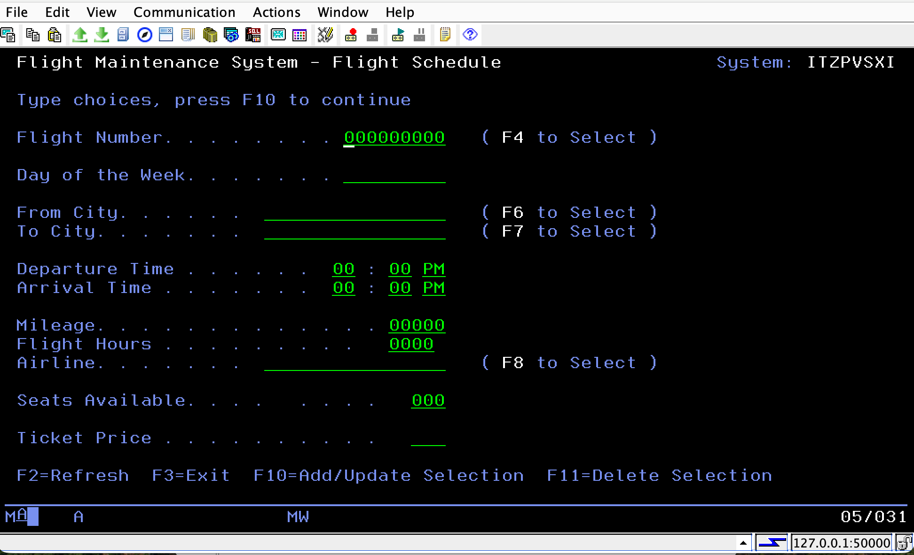

<pre>
  Bob may identify other programs that use `FLIGHTS` or `FLIGHTSZ`. 
  Those dependencies are valuable impact-analysis findings, but they are outside the scope of the exercise. 
  In a production change, those programs would be reviewed and recompiled separately. </pre>
  
&nbsp;

✅ **Exercise 3 completed** - You've added Total Flight Hours across the database, RPG program, and screen — from impact analysis and source changes to compilation and validation — with Bob's help!

---

## Exercise 4 — Database optimization

In this exercise, you will review a complex SQL query written by a junior developer, validate it, and apply Bob's index advisor to improve performance.

### 4.1. Review the query with Bob

1. In the Bob chat panel, use the mode selector to switch to **IBM i Database** mode.

2. Imagine the scenario where a junior developer wrote the following query to summarize flight bookings per flight per agent.

```sql
-- ============================================================
-- Flight Booking Summary — Per Flight, Per Agent
-- Shows: route details, airline, agent, ticket counts,
--        class breakdown, and ticket price
-- ============================================================
SELECT
    f.FLIGH00001                                    AS FLIGHT_NUMBER,
    f.DEPARTURE                                     AS FROM_CITY,
    f.ARRIVAL                                       AS TO_CITY,
    f.AIRLINES                                      AS AIRLINE,
    f.DAY_O00001                                    AS DAY_OF_WEEK,
    f.DEPAR00002                                    AS DEPARTURE_TIME,
    f.ARRIV00002                                    AS ARRIVAL_TIME,
    f.MILEAGE,
    f.TICKE00001                                    AS TICKET_PRICE,
    f.SEATS00001                                    AS SEATS_AVAILABLE,

    ag.AGENT_NAME,

    COUNT(DISTINCT o.CUSTO00001)                    AS UNIQUE_CUSTOMERS,
    SUM(o.TICKE00001)                               AS TOTAL_TICKETS_SOLD,

    SUM(CASE WHEN o.CLASS = 'F' THEN o.TICKE00001 ELSE 0 END) AS FIRST_CLASS_TICKETS,
    SUM(CASE WHEN o.CLASS = 'B' THEN o.TICKE00001 ELSE 0 END) AS BUSINESS_TICKETS,
    SUM(CASE WHEN o.CLASS = 'E' THEN o.TICKE00001 ELSE 0 END) AS ECONOMY_TICKETS,

    MIN(o.DEPAR00001)                               AS EARLIEST_BOOKING_DATE,
    MAX(o.DEPAR00001)                               AS LATEST_BOOKING_DATE

FROM FLGHT4nn/FLIGHTS       f
JOIN FLGHT4nn/ORDERS        o  ON o.FLIGH00001  = f.FLIGH00001
JOIN FLGHT4nn/AGENTS        ag ON ag.AGENT_NO   = o.AGENT_NO
LEFT JOIN FLGHT4nn/CUSTOMERS c  ON c.CUSTO00001  = o.CUSTO00001

WHERE o.DEPAR00001 >= TIMESTAMP('2004-02-08-00.00.00')
  AND o.DEPAR00001 <  TIMESTAMP('2004-02-11-00.00.00')

GROUP BY
    f.FLIGH00001,
    f.DEPARTURE,
    f.ARRIVAL,
    f.AIRLINES,
    f.DAY_O00001,
    f.DEPAR00002,
    f.ARRIV00002,
    f.MILEAGE,
    f.TICKE00001,
    f.SEATS00001,
    ag.AGENT_NAME

ORDER BY
    o.DEPAR00001,
    f.FLIGH00001

FETCH FIRST 100 ROWS ONLY;
```


3. ⚠️ Ask Bob to review the following SQL query using the comand `/review`, and replacing `nn` in the query with the two-digit suffix of your assigned library, (e.g. `01` for `FLGHT401`, `02` for `FLGHT402`), before pasting it into Bob.

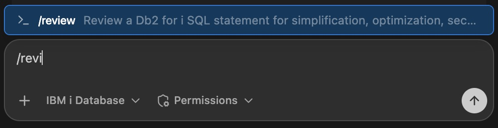
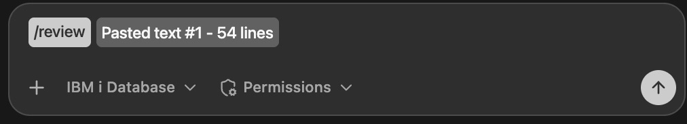

Bob may inspect the connected IBM i catalog to verify names and data types. Exact results may vary, but expect findings such as:

- ❌ ORDER BY o.DEPAR00001 uses a non-grouped, non-aggregated column and may cause SQL0122. Bob may replace it with MIN(o.DEPAR00001).
- ⚠️ The LEFT JOIN to CUSTOMERS is unused and can be removed.
- ⚠️ o.DEPAR00001 is DEPARTURE_DATE, so the booking-date aliases are misleading.
- ⚠️ TICKET_PRICE is stored as VARCHAR(22), which requires validation before numeric calculations.
- ✅ The CASE-based class breakdown is a clear, set-based approach.
- ✅ FETCH FIRST 100 ROWS ONLY is a useful testing safeguard.
- 💡 Bob may recommend using descriptive SQL column names instead of generated IBM i system names.

### 4.3. Explain the performance characteristics (optional)

1. After Bob has reviewed and corrected the query, ask:

```text
Is any table a performance bottleneck and why?
```

Bob should identify that:

- `ORDERS` is the largest table involved in the query
- The query filters on `DEPARTURE_DATE`
- Only a small fraction of rows qualify for the selected date range
- The date-range predicate is highly selective and a strong candidate for index optimization

### 4.4. Run the Index Advisor workflow

1. Still in **IBM i Database** mode, click the workflow icon at the top of the Bob panel, choose to run workflow in library list, and select **SQL Index Strategy Advisor**.


**Workflow configuration**

2. When prompted, use the following selections. Use an appropriate output library and object name when prompted.

| Setting | Value |
|---|---|
| Data Source | Capture New Performance Data |
| Capture Method | `DUMP_PLAN_CACHE_TOPN` |
| Output Library | FLGHT4nn |
| Output Object Name | FLGHT4nnP or something short but custom to your number |
| Top N Queries | 20 |
| Top N Category | Runtime |

⚠️ **Important lab rule — only create indexes in your assigned schema:**

- `FLGHT400` attendees create indexes only in `FLGHT400`
- `FLGHT401` attendees create indexes only in `FLGHT401`
- `FLGHT402` attendees create indexes only in `FLGHT402`
- etc.

Bob may discover similar recommendations in multiple `FLGHT4nn` schemas — this is expected because each schema contains a copy of the same application data. Do not create indexes in schemas that were not assigned to you.

The workflow may:

- Capture and analyze SQL performance data
- Examine plan cache information
- Review Index Advisor recommendations
- Examine any temporary index activity (MTIs)
- Identify candidate permanent indexes
- Generate `CREATE INDEX` statements
- Explain the expected performance benefit of each index

**Expected outcome** — recommendations may vary slightly depending on optimizer behavior, existing plan cache contents, and system state. Most attendees should receive recommendations similar to:

<pre>
CREATE INDEX FLGHT4nn.ORDERS_IDX_DEPDT_FLT
    ON FLGHT4nn.ORDERS (
        DEPARTURE_DATE,
        FLIGHT_NUMBER
    );
</pre>

or:

<pre>
CREATE INDEX FLGHT4nn.ORDERS_IDX_AGT_DEP
    ON FLGHT4nn.ORDERS (
        AGENT_NO,
        DEPARTURE_DATE
    );
</pre>

3. For this lab, review the highest-priority recommendation for your assigned schema — typically the index starting with `(DEPARTURE_DATE, FLIGHT_NUMBER)`. This index directly supports the query's selective date-range predicate and is generally the most impactful recommendation.

4. ⚠️ Ask Bob to apply the recommended index using the following prompt, replacing `nn` with the two-digit suffix of your assigned library (e.g. `01` for `FLGHT401`, `02` for `FLGHT402`).

```text
Apply the highest-priority index only for FLGHT4nn
```

&nbsp;

✅ **Exercise 4 completed** - You've reviewed, corrected, analyzed, and optimized a Db2 for i SQL statement using Bob's guided Index Advisor workflow — without needing deep expertise in query optimization, Visual Explain, or Index Advisor internals.

---

## Exercise 5 — Ask Bob about your system

In this exercise, you will use Bob in IBM i Developer mode to answer system-level questions using two natural language prompts.
1. Switch back to **IBM i Developer** mode.
   
2. Ask Bob which active jobs have accumulated the most CPU time:

```text
Which active jobs have accumulated the most CPU time? For the top jobs, distinguish cumulative CPU time from their current elapsed CPU percentage.
```

3. Now ask Bob to investigate the top-ranked job in more detail:

```text
Inspect the job ranked first and determine whether it is currently CPU-bound. Check its job log and take one fresh elapsed CPU measurement. If the log is empty and the job is a PASE process, inspect its IFS job information for its executable, working directory, and open application or log files. Stop after that investigation. Distinguish facts from inferences and provide no more than two recommendations
```

Bob will query the system services such as the `QSYS2.ACTIVE_JOB_INFO` table function and return a summary of active jobs with CPU utilization — giving you an instant health check on your LPAR, then use other tools to read the logs and other information, and create a first report. You might see the Node.js job running if you completed the optional React exercise and never stopped the web server.


4. Try to ask Bob which programs have not been recompiled in the last five years:

⚠️ Ask Bob the following, replacing `nn` with the two-digit suffix of your assigned library (e.g. `01` for `FLGHT401`, `02` for `FLGHT402`).

```text
Which programs in the FLGHT4nn library have not been recompiled in the last 5 years?
```

Bob will query `QSYS2.OBJECT_STATISTICS` filtering on object type `*PGM` in `FLGHT4nn`, compare the `LAST_USED_TIMESTAMP` or `OBJCREATED` attributes, and list the stale programs — perfect input for a modernization backlog.

&nbsp;

✅ **Exercise 5 completed** - You've used Bob to inspect active jobs and CPU usage, optionally investigated a job in more detail, and identified programs to review for modernization.

---

## Exercise 6 — RPGUnit test planning & implementation

In this exercise, you will use Bob's guided RPGUnit workflows to build a structured test plan for an IBM i program, then implement and run the test suites.

These two workflows work together in sequence:

- **RPGUnit Test Plan Creation** — analyzes your code's exported procedures and generates four types of structured Markdown documents: *Templates* (reusable blueprints), *Modules* (one doc per exported procedure, including flowcharts), *Test Suites* (planned test cases per module with inputs, assertions, and status), and *Test Utilities* (shared helper procedures). It runs any existing test suites first to determine the current test state.
- **RPGUnit Test Suite Implementation** — reads those test plan documents, writes or updates the RPGUnit source members, creates or updates `testing.json`, runs the suites, and iterates until all newly generated tests pass. It surfaces any pre-existing failures and asks whether to fix them.

### Prerequisites — Install RPGUnit

1. **Install IBM i Testing Extension**
   - Open VS Code Extensions, search for **"IBM i Testing"**, and click **Install**.

2. **Install RPGUnit to IBM i**
   - Open Code for IBM i connection settings (gear icon, bottom of screen).
   - Navigate to the **Components** tab → **Add Component** → select **RPGUnit** → **Install**.

3. **Update your library list** to include: `FLGHT4nn`, `RPGUNIT`, `QDEVTOOLS`.

### 6.1. Create a new source member `CUSTCHK`

Rather than modifying an existing program, you'll create a clean, standalone SQLRPGLE module with a single exported procedure — an ideal target for RPGUnit.

1. In the **Object Browser**, find the `QRPGLESRC` folder inside your assigned `FLGHT4nn` library. Right-click it and select **New Member**.

   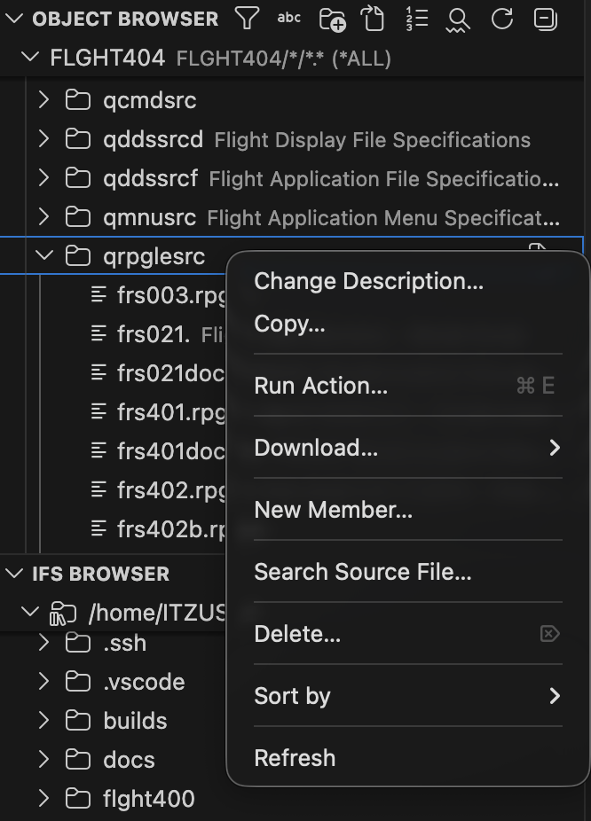

2. Enter the name **`CUSTCHK.SQLRPGLE`** and confirm.

3. Paste the following source (starting from `**free` and ending with `end-proc;`) into the new member and save with **Ctrl/Cmd + S**:

```rpgle
**free
ctl-opt nomain;

dcl-proc checkCustomerExists export;
  dcl-pi *n ind;
    custId packed(9:0) const;
  end-pi;

  dcl-s rowCount int(10);

  exec sql
    select count(*)
      into :rowCount
      from CUSTOMRZ
      where CUSTNO = :custId;

  return (SQLCODE = 0 and rowCount > 0);
end-proc;
```

This module is a clean target for the RPGUnit workflows: it's `NOMAIN`, has one exported procedure with a typed parameter and return value, contains no display file or interactive logic, and compiles naturally as a `*MODULE` or `*SRVPGM`.

### 6.2. Run the RPGUnit Test Plan Creation workflow

1. Click the workflow icon at the top of the Bob panel and choose **RPGUnit Test Plan Creation** in your library list.

   

2. Click **Get Started**.
3. Select your library `FLGHT4nn`.
4. When prompted for the IFS project directory, enter a path unique to your library (e.g., `/home/<user>/flght4nn`).
5. If this is your first time, tell Bob to **create a new test plan** when asked.
6. Keep the proposed test plan structure or adjust it to your preference. If you do change it, remember the values you picked.
7. For the goal, select the **default recommended path**.
8. Let Bob locate testable files automatically — it should find `CUSTCHK.SQLRPGLE` as the only suitable candidate.
9. Select the exported procedure and click **Proceed**.
10. Choose to **validate the environment** as recommended and proceed.
11. Install RPGUnit and add to library list if prompted; do the same for `QDEVTOOLS`.

12. Bob will write the test plan documents and store them in the IFS directory you specified. At the bottom of the chat panel, review the files it created — these Markdown documents will be used in step 6.3.

13. 💡 If Bob asks to run the RPGUnit Test Plan Creation workflow again at any point, select **No thanks**.

### 6.3. Run the RPGUnit Test Suite Implementation workflow

1. Click the workflow icon and choose **RPGUnit Test Suite Implementation** in your library list. Click **Proceed** since the required test plan was already created in step 6.2.
2. Select your library `FLGHT4nn`.
3. When prompted for the IFS project directory, enter the same path used in step 6.2.
4. When locating test plan documents, confirm the path to the test suites is correct — Bob should pre-fill the correct default.
5. Choose to **validate the environment**.
6. If Bob prompts to download RPGUnit again, click **Install**, then **Cancel** on the follow-up popup that asks to delete the existing version.

Bob will generate the test source members, run the suites, and iterate until the new tests pass or Bob discovers an error in the source code. Results appear in the **Test Results** tab at the bottom of your screen.


7. 💡 If any tests fail, ask Bob to explain the failure and help fix it.

&nbsp;

✅ **Exercise 6 completed** - You've used Bob's guided workflows to go from untested legacy RPG to a structured, executed RPGUnit test suite — without writing test boilerplate by hand.

---

## Exercise 7 (OPTIONAL) - Generate a React Carbon app from a green screen

In this exercise, you will use Bob in **IBM i Developer** mode to analyze the FLIGHT400 *Create Order* 5250 screen and generate a modern React web application styled with the IBM Carbon Design System, running directly on IBM i PASE.


### Environment setup

1. Request the private key from the instructor and place the `ssh_private_key.pem` file in your lab folder.

2. You wil have to create an SSH tunnel to the TechZone IBM i environment.

The SSH tunnel forwards the services needed for this lab to your local machine:

- `<DEV_PORT>` — your assigned development port, used for the React/Vite application.
- `50000` — used for the IBM i 5250 connection.

3. 💡 Replace `<DEV_PORT>` with the port assigned to your library. For example, `FLGHT401` uses port `3001`, `FLGHT402` uses port `3002`, and so on.

4. 💡 Replace `<myuser>@<myIPaddress>` with the connection information provided by TechZone.

#### For Windows users:

1. Open **PowerShell or Windows Terminal as Administrator**, navigate to your lab folder, and run:

```bash
ssh -N -L <DEV_PORT>:localhost:<DEV_PORT> -L 50000:localhost:23 -i .\ssh_private_key.pem <myuser>@<myIPaddress>
```

#### For macOS / Linux users:

1. Open a terminal, navigate to your lab folder, and run:

```bash
chmod 600 ./ssh_private_key.pem && ssh -N -L <DEV_PORT>:localhost:<DEV_PORT> -L 50000:localhost:23 -i ./ssh_private_key.pem <myuser>@<myIPaddress>
```

#### After connecting (all platforms):

1. 💡 Keep this terminal open while working on the lab. Closing the SSH session will close the tunnel.

### Sharpen your skill

Before generating the React app, give Bob some extra context about running React + Vite on IBM i PASE by creating a small helper Skill.

1. In Agent mode, click the **`+`** button (top right) and select **Local Workspace** as the task context.
2. Open [SAMPLE-SKILL.md](./SAMPLE-SKILL.md), copy its entire content, and paste it into the chat prompt.
3. Append the following instruction and send:

```text
Create a skill from the pasted text.
```

### Expected result

Bob creates a new Skill that improves its awareness of PASE-specific details for React and Vite projects. This lightweight Skill will be picked up automatically in the next step.

### Prompt in Bob chat UI

1. Switch to IBM i Developer mode, then Click on the `+` button (top right) and select  the `FLGHT4nn` (library list) as a context of for the task. Paste this [screenshot](./pics/flight400.png) alongside the following prompt:

2. ⚠️ Ask Bob the following, replacing `nn` with the two-digit suffix of your assigned library (e.g. `01` for `FLGHT401`, `02` for `FLGHT402`). Also replace `30nn` with your assigned development port (e.g. `3001` for `FLGHT401`, `3002` for `FLGHT402`).

```text
Given this screenshot of the 5250 flight order screen from the Application Flight4nn in @FLGHT4nn, Build a single-page React 18 + Vite 4 app on IBM i (PASE) using @carbon/react ^1.x with dark theme that modernizes the IBM i 5250 screen shown in the attached screenshot. Create the app in the IFS at $HOME/flight4nn-frontend-apps/screen-name/. Use the g100 dark theme. All fields should have a list of values to select from. Pin the Vite dev server to port 30nn if available. Launch the server, and give the final URL.
```

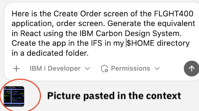

### Expected result

Bob generates a full React application, including:

- Carbon components (`Tile`, `TextInput`, `RadioButtonGroup`, `Modal`, `Button`) mirroring the 5250 layout
- Selection modals replacing DDS subfile windows
- The RPG pricing formula ported to JavaScript
- pure JavaScript, no native binaries, running natively in IBM i PASE

1. To see what files Bob generated, click 'Show all' on the 'File Changed' item at the Bottom of the Bob Chat Panel.

2. Start the app from your IBM i PASE shell, or ask Bob to start the dev server for you:

```bash
cd /home/<your-user>/flight4nn-frontend-apps
# Build
/QOpenSys/pkgs/bin/bash build.sh

# Dev server (background — does not block your terminal)
nohup /QOpenSys/pkgs/bin/bash start-dev.sh > /tmp/vite-dev.log 2>&1 &

# Check which port Vite actually bound to:
cat /tmp/vite-dev.log
```

3. Then open `http://localhost:30nn` in your browser.
**Note that port number, and application look & feel can differ. If your browser isn't showing anything, make sure you've completed step 2 of environment setup and it includes your port.**

### Skills & tools used behind the scenes

In addition to the sample Skill we created in step 1, we've just used a set of unique Skills that are shipped with the Premium Package for i :

| Tool / Skill | Role |
|---|---|
| `dds-primer-basics` skill | Parses `FRS001DF.DSPF` — screen layout, field names, subfile windows |
| `rpg-primer-basics` skill | Reads `FRS001.RPG` — extracts pricing logic and field definitions |
| IFS write tools | Creates project files directly in `$HOME/flight4nn-react/` on IBM i |
| IBM i PASE | Runs `npm install`, `npm run build`, `npm start` natively on IBM i |

1. ⚠️ Ask Bob to stop the development server when you finish exploring the React app, replacing `nn` with the two-digit suffix of your assigned library (e.g. `01` for `FLGHT401`, `02` for `FLGHT402`). Also replace `30nn` with your assigned development port (e.g. `3001` for `FLGHT401`, `3002` for `FLGHT402`).

```text
Stop the web service for FLGHT4nn on port 30nn
```

⚠️ This app runs with sample data only. The natural next step is to add a REST / Web Services layer connecting the React front end to the real IBM i business logic and Db2 for i database.

&nbsp;

✅ **Optional exercise completed** - You've created a helper skill, generated and launched a React Carbon app from the FLIGHT400 green screen, and stopped its development server after exploring the result.

---

## Summary

Congratulations! In this lab you:

| Exercise | What You Did |
|---|---|
| **Setup** | Connected to IBM i and selected your assigned FLIGHT400 library |
| **Exercise 1** | Generated architecture docs and an ERD with Bob |
| **Exercise 2** | Explained and modernized OPM RPG `FRS409` to free-format ILE RPG |
| **Exercise 3** | Added a new field to a 5250 display file with Bob's help |
| **Exercise 4** | Reviewed and optimized a SQL query using Bob's database tools |
| **Exercise 5** | Queried your IBM i system using natural language |
| **Exercise 6** | Created and implemented an RPGUnit test suite with Bob's guided workflows |
| **Exercise 7** | UI modernization, 5250 to React |

**Next steps:** Explore connecting the React app to live IBM i data via a Node.js or Java REST API, or dive deeper into the RPG modernization workflow for the other FLIGHT4nn programs.
